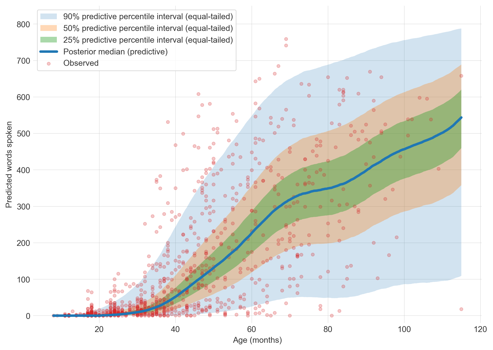
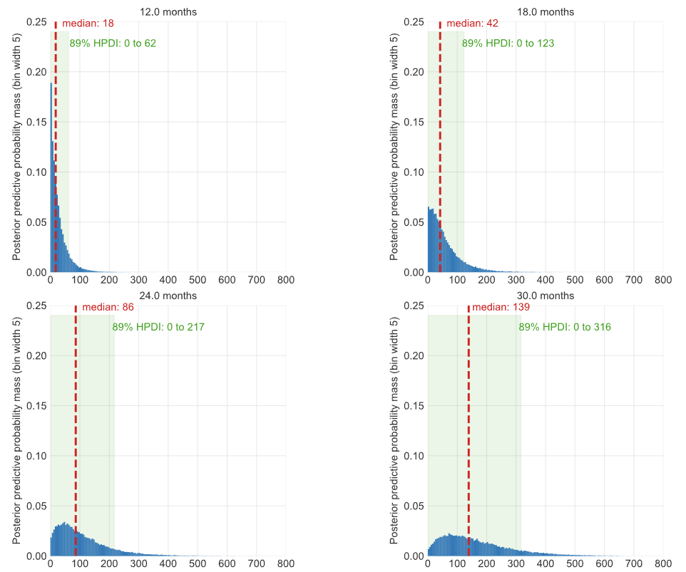

# Vocabulary growth in children with Down syndrome

> [!WARNING]
> This is work in progress. All data and models are preliminary.

**This repository hosts an exploratory study of vocabulary development in children with Down syndrome that aims to characterise observed trajectories of word learning, spoken and gestured production, and relationships between words understood and produced. The primary goal of the study is to provide interpretable statistics that can accurately inform expectations, intervention and teaching practice.**

## About this study

All children with Down syndrome experience delays in language development. By quantifying typical trajectories of vocabulary development we can offer families and practitioners insights into expected ranges and rates of progress. These can help to inform teaching goals and methods, and to identify children experiencing more complex or challenging difficulties. This study aims to provide accurate estimates of typical trajectories of word learning and distributions of expected spoken and understood word counts at six monthly intervals for children with Down syndrome aged 12 months to 8 years.

The project draws together parent-reported vocabulary checklist data - from the MacArthur-Bates CDI and similar instruments - to characterise how comprehension and spoken vocabulary progress with age, and how the two relate over the course of development. By pooling data across studies and languages and analysing it with modern Bayesian methods, we aim to produce clear, interpretable estimates of typical trajectories and the variation around them.

Up-to-date, well-evidenced information about how language develops in young children with Down syndrome matters a great deal in practice. It helps families understand what to expect, and it gives healthcare professionals, speech and language therapists, and teachers a sound basis for setting realistic goals and choosing where to focus teaching and intervention.

### Approach

We are developing joint, hierarchical Bayesian models of words understood, words signed and words spoken, with a structural decomposition in which spoken and signed vocabulary are modelled as age-varying fractions of understood vocabulary, and Gaussian Processes capture non-linear change with age. We evaluate and fit these models using Bayesian inference to estimate full probability distributions for parameters of interest, using an iterative workflow.

For children with Down syndrome, we are aggregating multiple datasets of parent-reported vocabulary achievement from multiple research groups and countries. For models of typical development, we are using MacArthur-Bates Communicative Development Inventory (MB-CDI) data from the [Wordbank database](https://wordbank.stanford.edu/).

### Study outputs

This is an iterative and exploratory study and we are continuing to receive additional data, so possible outputs are still evolving. Currently, these are some of the outputs we hope to deliver.

#### 1. Reliable estimates of growth in vocabulary over time

We are interested in understanding how many words children with Down syndrome learn over time and the rates at which the they learn words at different ages.



<p style="border-left:4px solid #ccc;padding-left:.75rem;"><b>Posterior predictive median trend of words understood by children with Down syndrome.</b> (⚠️ All estimates are preliminary and subject to change as further data is received and models refined.)
</p>

#### 2. Reliable estimates of the spread of vocabulary knowledge at specific ages

In additional to central growth trends, we are interested in understanding the range of vocabulary learning at different ages.



<p style="border-left:4px solid #ccc;padding-left:.75rem;"><b>Posterior predictive distributions of words understood by children with Down syndrome at 12, 18, 24 and 36 months.</b> (⚠️ All estimates are preliminary and subject to change as further data is received and models refined.)</p>

#### 3. Reliable estimates of the proportions of words spoken over time

We are interested in the proportion of words understood by children with Down syndrome that they can say, and how this changes over time. We are also interested in how this compares to typically developing children with similar total vocabularies.

#### 4. Reliable estimates of the variation in word learning

We are interested in the extent to which word learning varies between individuals, and exploring the extent to which there is more or less variation among children with Down syndrome when compared to typically developing children.

In the future, we hope to gather additional data to beging to explore possible predictors of differences in word learning between individuals.

### Open and replicable

We are developing, evaluating and iterating our models openly in this repository, where we share all source code and anonymised source data under permissive licenses.

### Future directions

We welcome partners interested in deepening our understanding of language development for children with Down syndrome. Over time, we may extend this project to explore further data sets and modelling techniques and welcome input from interested partners on how the project might evolve.

When Down Syndrome Education International launches its [LearningTracker app and services](https://www.learningtracker.app/) we expect to make additional parent-reported vocabulary data available to extend this project in the future.

## Contributing

We welcome partners interested in developing and evaluating statistical models, evaluating and interpreting findings, and sharing original data.

- [See our guidelines for contributors](./CONTRIBUTING.md)

## Getting started

### Clone repositories

In the same directory (perhaps `dseinternational`):

```bash
git clone https://github.com/dseinternational/vocabulary-growth.git
```

For now, also:

```bash
git clone https://github.com/dseinternational/research.git
```

### Prerequisites

#### Fitting models

To fit models, a recent Python installation is required. Some of our dependencies are best installed from [conda-forge](https://conda-forge.org/), for which either [Miniconda](https://www.anaconda.com/docs/getting-started/miniconda/main) or [Miniforge](https://conda-forge.org/download/) is required.

Then, to install Python dependencies, from the repository root:

```bash
conda env update -f environment.yml
```

#### Creating reports

To update or create reports, [Quarto](https://quarto.org/docs/get-started/) is required. We also use CSpell for checking spelling, for which a recent installation of [Node.js](https://nodejs.org/en) is required.

To install Node dependencies, from the repository root:

```bash
npm install
```

### Preparing data

From the repository root:

Activate the Conda environment (if not yet activated):

```bash
conda activate dse-vocab-growth
```

Run the script:

```bash
python scripts/prepare_data.py
```

## License

All source code in this repository is licensed under the GNU Affero General Public License v3.0 **(AGPL-3.0-only)**. See `LICENSE`.

Some other artifacts are licensed under other licenses:

- **Code**: GNU Affero General Public License v3.0 (AGPL-3.0) — see `LICENSE`.
- **Documentation, reports and papers**: Creative Commons Attribution 4.0 International (CC BY 4.0) — see `docs/LICENSE`.
- **Data**: Creative Commons Attribution 4.0 International (CC BY 4.0) — see `data/LICENSE` for details.

AGPL-3.0 requires that if you modify and run this software to provide a network service, you must offer the corresponding source code to users of that service.
